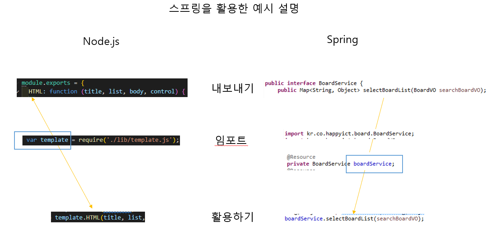
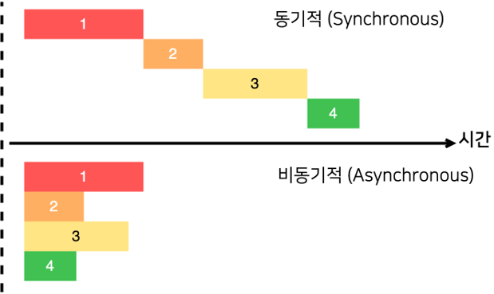

# [FE] 개발팀 코드 리뷰 - 1주차

## 목차

1. [소개](#소개)
2. [Node.js?](#nodejs)
3. [Node.js 선행학습](#nodejs-선행학습)
4. [모듈(Module)](#모듈module)
5. [동기(Synchronous), 비동기(Asynchronous)](#동기synchronous-비동기asynchronous)
6. [Node.js에서 GET, POST 사용하기](#nodejs에서-get-post-사용하기)
7. [Package Manager?](#package-manager)
8. [API?](#api)

## 소개

- 인프런의 'WEB2 - Node.js' 강의 리뷰.
- [강의 주소](https://www.inflearn.com/course/web2-node-js)
- [유튜브 재생목록](https://www.youtube.com/playlist?list=PLuHgQVnccGMA9QQX5wqj6ThK7t2tsGxjm)
- [소스코드](https://github.com/web-n/Nodejs)

## Node.js?

- 오픈 소스 JavaScript 엔진인 크롬 V8에 _비동기 이벤트_ 처리 라이브러리인 libuv를 결합한 플랫폼.
- JavaScript로 브라우저 밖에서 서버를 구축하는 등의 코드를 실행할 수 있게 해주는 런타임 환경.
- 내장 모듈인 'http'를 사용하여 별도의 소프트웨어 없이 웹서버를 구동시킬 수 있다.

```javascript
// http 서버 생성
const http = require("http")

const app = http.createServer((request, response) => {
  let _url = request.url
  let pathname = url.parse(_url, true).pathname

  if (pathname === "/") {
    res.writeHead(200)
    res.end("Hello World")
  }
})
```

## Node.js 선행학습

- JavaScript. 강의 내용 중간중간에 JavaScript 강의가 있으므로 참고한다.
- JSON

## 모듈(Module)?

- 독립된 기능을 갖는 것(함수, 파일)들의 모임.
- 절차지향으로 모든 기능을 써내려 가는 것보다, 기능별로 함수를 만들어 함수를 호출하는 방식. 유지보수가 편해짐.
- 외장 모듈

  - 일반 Node.js 개발자들이 만들어 놓은 모듈(라이브러리).
  - 외장 모듈을 사용하기 위해서는 npm(Node Package Manager)을 사용.

- 내장 모듈

  - Node.js를 설치하고 나면 그 안에 이미 제공되어지는 모듈.
  - 내장 모듈은 이미 Node.js를 설치할 때 존재하기 때문에 npm을 사용하지 않음.

- 이해를 돕기 위한 이미지
  

```javascript
// 모듈 생성
module.exports = {
  HTML: function (title, list, body, control) {
    return `
  <!DOCTYPE html>
  <html lang="ko">
    <head>
      <title>WEB1 - ${title}</title>
      <meta charset="utf-8">
    </head>
    <body>
      <h1><a href="/">WEB</a></h1>
      ${list}
      ${control}      
      ${body}
    </body>
  </html>`
  },
}

// 모듈 호출
const template = require("./lib/template")

// 모듈 실행
const html = template.HTML(
  title,
  list,
  `<h2>${title}</h2><p>${description}</p>`,
  `<a href="/create">create</a>`
)
```

## 동기(Synchronous), 비동기(Asynchronous)

- [동기, 비동기 처리](https://velog.io/@daybreak/%EB%8F%99%EA%B8%B0-%EB%B9%84%EB%8F%99%EA%B8%B0-%EC%B2%98%EB%A6%AC)
- WEB API, 파일 읽기 등과 같이 소요시간이 있는 상황에서는 병렬적으로 수행하기 때문에 로직 상 문제가 생길 수 있으면 동기화를 시켜야 한다.
- 예시에서 나온 동기화 처리 지원 함수가 아니라도 async/await, promise와 같은 다른 방식으로 동기화 처리를 할 수 있다.

- 이해를 돕기 위한 이미지
<p>
  
</p>

### async/await, promise

- https://velog.io/@pilyeooong/Promise%EC%99%80-asyncawait-%EC%B0%A8%EC%9D%B4%EC%A0%90

## Node.js에서 GET, POST 사용하기

### GET

```javascript
let queryData = url.parse(_url, true).query

// queryData.XXX -> XXX에서 url에서 파라미터 변수를 지정
let id = queryData.id
```

### POST

- https://nodejs.org/ko/docs/guides/anatomy-of-an-http-transaction/

```javascript
// 'data'는 데이터를 가공
request.on("data", function (data) {
  body += data
})

// 'end'는 가장 마지막에 수행할 작업
request.on("end", function () {
  const post = qs.parse(body)
  const title = post.title
  const description = post.description
})
```

## Package Manager?

- 패키지를 다루는 작업을 편리하고 안전하게 수행하기 위해 사용되는 툴.
- 패키지를 다루는 작업이란 패키지를 설치, 업데이트, 수정, 삭제하는 작업을 의미.

### npm

- [PM2](https://pm2.keymetrics.io)
  - 데몬 프로세스 매니저
    - pm2 start/stop/monit 등등
- [sanitize-html](https://www.npmjs.com/package/sanitize-html)
  - XSS 방어

## API?

- *A*pplication *P*rogramming *I*nterface
  - 응용 프로그램 프로그래밍 인터페이스. 프로그래밍에서, 프로그램을 작성하기 위한 일련의 부(Sub) 프로그램, 프로토콜 등을 정의하여 상호 작용을 하기 위한 인터페이스 사양을 말함.
  - https://namu.wiki/w/API
  - https://nodejs.org/dist/latest-v18.x/docs/api/
