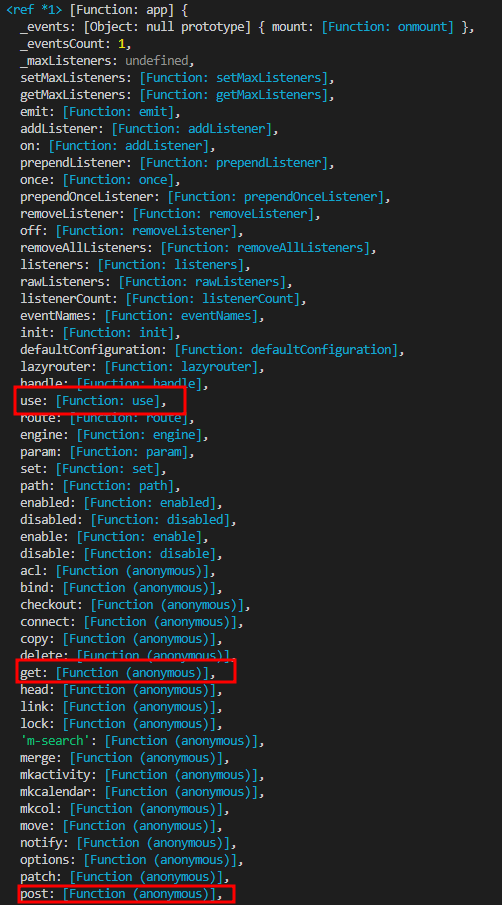

# [FE] 개발팀 코드 리뷰 - 3주차

## 목차

1. 개요
2. Express.js?
3. Express 기본 사용법
4. 페이지 구현
5. 동적페이지의 param 구하기
6. 미들웨어 body parser
7. 라우터

## 개요

- 인프런의 'Node.js - Express' 강의 Express 파트를 참고했습니다.
- [강의 주소](https://www.inflearn.com/course/node-js-express)

## Express.js?

- [공식 사이트](https://expressjs.com)
- Node.js를 위한 빠르고 개방적인 간결한 **웹 프레임워크**<sup>[1](#footnote1)</sup>

## Express 기본 사용법

```js
/*
express 호출
*/
const express = require("express")
const app = express() // 자바스크립트의 구조분해할당 사용

/*
호출 한 express 사용
*/
app.XXX()
```

- console.log로 찍어본 express()는 다음과 같이 나와 구조분해할당[링크속 구조분해할당 참고](https://github.com/EastZero123/Node.js/blob/week1/README.md)()을 사용해 객체 접근을 할 수 있다 <br/>
- app.XXX에서 XXX에는 express 내장함수를 사용할수 있다<br/>
- [express 내장함수 목록](https://expressjs.com/ko/4x/api.html)<br/><br/>

## 페이지 구현

```js
const express = require("express")
const app = express()

app.METHOD("Something", function (req, res) {
  // 함수 구문
})

app.listen(3000, () => console.log("http://localhost:3000"))
```

- `http://localhost:3000/Something`으로 접속하면 app.METHOD의 함수구문이 실행된다<br/>
- METHOD<sup>[2](#footnote2)</sup>를 활용해 페이지를 구현할 수 있다<br/><br/>

## 동적페이지의 param 구하기

```js
const express = require("express")
const app = express()

app.get("/test/:params", function (req, res) {
  console.log(req.params)
})
```

`http://localhost:3000/test/123123`로 접속하면
{ params: '123123' } 가 콘솔 출력된다<br/><br/>

## 미들웨어<sup>[3](#footnote3)</sup> body parser

```js
const express = require("express")
const app = express()
var bodyParser = require("body-parser")

app.use(bodyParser.urlencoded({ extended: false }))
app.METHOD1()
app.METHOD2()
```

- 기존에 undefined로 뜨던 req.body를 접근할수 있게 만들어준다<br/>
- METHOD1로 접근을 하던 METHOD2로 접근을 하던 위에서 아래로 진행되는 특성상 app.use로 사용되는 bodyParser는 무조건 실행된다<br/>
- urlencoded의 extended는 qs모듈(추가적인 보안 기능이 있는 파싱) 사용 여부를 선택한다(사용할 시 qs npm 라이브러리 추가 설치 필요) [자세한 차이를 확인하기 - stackoverflow참조](https://stackoverflow.com/questions/29960764/what-does-extended-mean-in-express-4-0/45690436#45690436)<br/><br/>

## 라우터<sup>[4](#footnote4)</sup><br/>

공통적으로 겹치는 주소를 하나로 묶어서 하나의 파일에 코드가 길게 쓰이는 것을 막을수있다

```js
const express = require("express")
const app = express()

app.get("/test/c", function () {})
app.get("/test/r", function () {})
app.get("/test/u", function () {})
app.get("/test/d", function () {})
```

위의 코드를 라우터기능을 활용하면 다음과 같이 쓸 수 있다

```js
// ./index.js
const express = require("express")
const app = express()
var testRouter = require("./routes/test")

app.use("/test", testRouter)

// ./routes/test.js
const express = require("express")
const router = express.Router()

router.get("/c", function () {})
router.get("/r", function () {})
router.get("/u", function () {})
router.get("/d", function () {})
```

- 코드가 더 많아졌다고 생각할 수 있지만 /test/~ 를 /realtest/~ 형태로 수정해야하는 상황이 생기는 경우 라우터 기능을 활용한 예시가 수정하기 용이하다<br/>

---

<u><a name="footnote1">1</a></u>[https://namu.wiki/w/%ED%94%84%EB%A0%88%EC%9E%84%EC%9B%8C%ED%81%AC](https://namu.wiki/w/%ED%94%84%EB%A0%88%EC%9E%84%EC%9B%8C%ED%81%AC)<br/>
동적인 웹 페이지나, 웹 애플리케이션, 웹 서비스 개발 보조용으로 만들어지는 프레임워크의 일종이다.<br/>
웹 페이지를 개발하는 과정에서 겪는 어려움을 줄이는 것이 주 목적으로 통상 데이터베이스 연동, 템플릿 형태의 표준, 세션 관리, 코드 재사용 등의 기능을 포함하고 있다.<br/><br/>
프레임워크 - 프로그래밍에서 특정 운영 체제를 위해서 일정하게 짜여진 틀, 부속품을 말한다.<br/><br/>
<u><a name="footnote2">2</a></u> GET,POST,PUT,DELETE등 Http 요청 메소드를 의미한다<br/><br/>
<u><a name="footnote3">3</a></u> HTTP 요청과 응답 사이에서 동작하는 함수이다<br/><br/>
<u><a name="footnote4">4</a></u> 라우터는 클라이언트의 요청 경로(path)를 보고 이 요청을 처리할 수 있는 곳으로 기능을 전달해주는 역할을 한다<br/>
